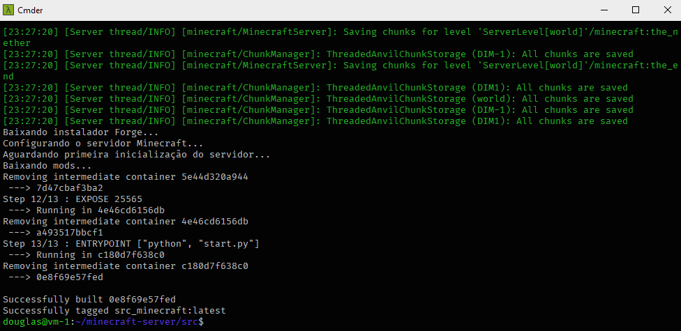
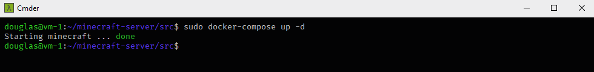
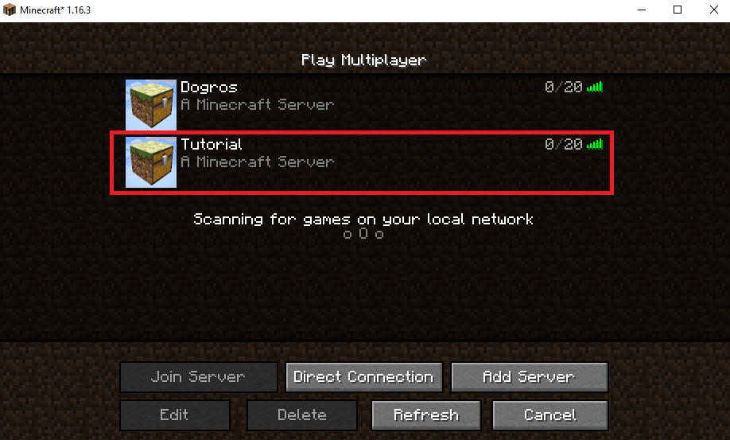
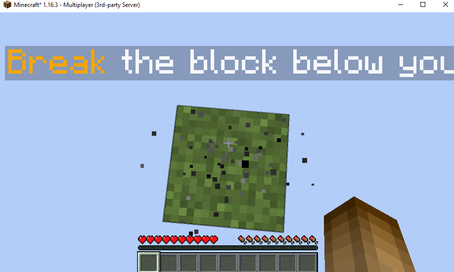

# Minecraft Server Sky Block Docker

This application helps to create a Minecraft server using the [SkyBlock](https://www.minecraftmaps.com/survival-maps/skyblock) mod.

## 💻 Project

#### Building the project


#### Starting server


#### Servers screen


#### In game



## 🏃 Usage

Before you start the server theres some commands that you have to run, just copy and paste one by one the commands bellow:
```bash
sudo apt-get update -y
sudo snap install docker
sudo curl -L "https://github.com/docker/compose/releases/download/1.27.4/docker-compose-$(uname -s)-$(uname -m)" -o /usr/local/bin/docker-compose
git clone https://github.com/douglasJovenil/minecraft-server-docker
cd minecraft-server/src
sudo docker-compose build
```
Now to run:
```bash
sudo docker-compose up -d
```
**IMPORTANT**: remember to open the port **25565** on your **firewall**.


## SSH On GCloud
If your machine is on GCloud platform, you maybe want to change the SSH authentication method, bellow is a step-by-step showing how you can do it:

Open the file **/etc/ssh/sshd_config**, and change the following line :
```bash
PasswordAuthentication no
```
to:
```bash
PasswordAuthentication yes
```
then:
```bash
sudo service ssh restart
sudo adduser USERNAME
sudo usermod -aG sudo USERNAME
```

Now you can login into your machine using the user **USERNAME**.